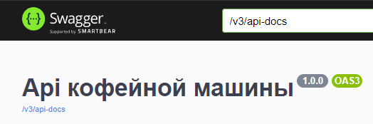
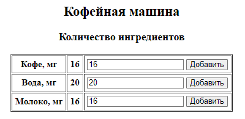

# TestApp

<h3>Запуск приложения</h3>

Oracle OpenJDK 17, PostgreSQL 16.4

Предварительно необходимо создать БД coffeeDB (или с иным названием - этот параметр, как и пользователь указаны в application.properties), далее flyway создаст таблицы и начальные данные.

Для работы приложения используется порт 8080. Класс для запуска - DemoApplication.

Enable annotation processing - необходимо для работы lombok.

<h3>Работа приложения</h3>

Swagger доступен по ссылке /swagger-ui/index.html#/

Интерфейс представлен таблицей ингредиентов в кофемашине, списом рецептов и информационным полем.

В таблице ингредиентов можно добавить (или убавить, указав отрицательное количество) миллиграмм кофе, воды или молока.

В части напитков можно добавить новый рецепт (ингредиенты указаны в миллиграммах, время приготовления в миллисекундах), удалить, заказать имеющиеся. Заказ занимает машину на время, указанное в рецепте. Список сортируется по количеству заказов, таким образом можно отследить самые популярные.

Информационное поле регистрирует действия пользователя и предупреждает его о "неправильных" действиях.

Можно настроить язык приложения (application.properties, app.lang назначить ru или en).
